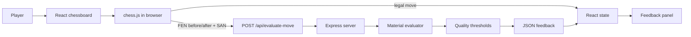

# Chess Move Tutor

Chess Move Tutor is a small full-stack learning application that gives immediate feedback after a player makes a move. The user drags a piece on an interactive chessboard, the browser validates and applies the move, and an Express backend evaluates the material change and returns a plain-language assessment.

The project is intentionally compact: it demonstrates a React client, a JSON API, chess rules and notation, asynchronous UI state, and a path toward a more capable chess-coaching product.

## What It Does

- Displays a standard chess starting position.
- Allows pieces to be moved by drag and drop.
- Rejects illegal moves in the browser before making an API request.
- Automatically promotes pawns to queens when a promotion is required.
- Lets the player choose a side and maximum difficulty before clicking `Start Game`.
- Places the selected player color at the bottom of the board and lets the AI open when Black is selected.
- Highlights the source and destination squares of the latest move.
- Sends the position before and after the move to the backend.
- Displays the material evaluation before and after the move, the score difference, a quality label, and a short explanation.
- Resets the board and clears feedback without reloading the page.

## Important Scope Note

The current evaluator is a deliberately simple stub, not a chess engine. It counts material only:

| Piece | Value |
| --- | ---: |
| Pawn | 100 cp |
| Knight | 320 cp |
| Bishop | 330 cp |
| Rook | 500 cp |
| Queen | 900 cp |
| King | 0 cp |

It does not calculate legal continuations, positional strength, checkmate threats, king safety, pawn structure, development, tactics, or a genuine best move. The API currently reports the move the player made as `bestMove`. The UI is therefore best understood as a material-change teaching prototype rather than an authoritative game analysis tool.

## Architecture



### Request flow

1. `App` creates a copy of the current game from its FEN position.
2. `chess.js` attempts the dragged move using `{ from, to, promotion: 'q' }`.
3. If the move is illegal, the handler returns `false` and the board remains unchanged.
4. If it is legal, the client stores the new game state and sends the old FEN, new FEN, and SAN move notation to the API.
5. The backend evaluates both positions from material values, adjusts the difference to the moving player's perspective, and classifies the move.
6. The client renders the response and clears the loading state.

## Technology Choices

### Frontend

- **React 19** for component-based UI and local state management.
- **Create React App / `react-scripts`** for development, testing, and production bundling.
- **`react-chessboard`** for the board interaction and rendering.
- **`chess.js`** for FEN handling, legal move validation, and SAN generation.
- **React Testing Library** for focused rendering tests.

The main UI is split into a board column and a feedback panel. `App` owns the game, loading, feedback, and last-move state. `FeedbackPanel` and `ScoreBar` keep presentation details separate from move handling.

### Backend

- **Node.js** runs the server.
- **Express 5** provides the HTTP API.
- **CORS middleware** allows the development frontend on port `3000` to call the backend on port `4000`.
- **`chess.js`** parses the submitted FEN positions before material is counted.

There is no database, authentication layer, server-side session, or persistent game storage. Each evaluation is stateless and derives its result only from the submitted request.

## Pinned Versions

Direct dependencies use exact versions in both `package.json` files. The lockfiles also record the resolved transitive dependency tree, so clean installs can reproduce the same package set.

| Package | Area | Version |
| --- | --- | ---: |
| Node.js | Runtime | 22 LTS recommended |
| `chess.js` | Frontend and backend | `1.4.0` |
| `cors` | Backend | `2.8.6` |
| `express` | Backend | `5.2.1` |
| `@testing-library/dom` | Frontend | `10.4.1` |
| `@testing-library/jest-dom` | Frontend | `6.9.1` |
| `@testing-library/react` | Frontend | `16.3.2` |
| `@testing-library/user-event` | Frontend | `13.5.0` |
| `react` | Frontend | `19.2.8` |
| `react-chessboard` | Frontend | `5.12.1` |
| `react-dom` | Frontend | `19.2.8` |
| `react-scripts` | Frontend | `5.0.1` |
| `web-vitals` | Frontend | `2.1.4` |

Use `npm ci` for a clean install from the lockfiles. Avoid manually changing dependency versions without regenerating and reviewing the corresponding lockfile.

## Repository Layout

```text
.
├── README.md
├── requirements.txt          # Root dependency note; installs are managed by npm manifests
├── backend/
│   ├── index.js              # Express server and evaluation endpoint
│   └── package.json
└── frontend/
		├── package.json
		├── public/               # CRA static entry files
		└── src/
				├── App.js            # Board workflow and feedback components
				├── App.css           # Application styling
				├── App.test.js       # Basic rendering tests
				└── index.js          # React entry point
```

## Getting Started

### Prerequisites

- Node.js 18 or newer is recommended.
- npm, included with Node.js.

### Install

Install each package set independently because the repository does not currently have a root `package.json`:

```bash
cd backend
npm install

cd ../frontend
npm install
```

### Run locally

Open two terminal windows from the repository root.

Terminal 1, start the API:

```bash
cd backend
npm start
```

The backend listens on `http://localhost:4000` by default.

Terminal 2, start the React development server:

```bash
cd frontend
npm start
```

Open `http://localhost:3000`. The frontend uses `REACT_APP_BACKEND_URL` when provided; otherwise it calls `http://localhost:4000`. The frontend package also declares a CRA proxy for local development.

### Environment variables

| Variable | Component | Default | Purpose |
| --- | --- | --- | --- |
| `PORT` | Backend | `4000` | Changes the Express listening port. |
| `REACT_APP_BACKEND_URL` | Frontend | `http://localhost:4000` | Changes the API base URL at build/start time. |
| `AWS_REGION` | Backend | `us-east-1` | AWS region used for Bedrock requests. |
| `BEDROCK_MODEL_ID` | Backend | `amazon.nova-pro-v1:0` | Bedrock model used for the AI opponent. |
| `AWS_BEARER_TOKEN_BEDROCK` | Backend | none | Temporary Bedrock bearer token used for local development. |

For local development, copy `backend/.env.example` to `backend/.env` and replace the placeholder with a new token. The backend loads that ignored file with `dotenv`. AWS credentials must remain server-side; never put AWS access keys or Bedrock credentials in frontend code or `REACT_APP_*` variables. The AI opponent requires AWS Bedrock access; if Bedrock is unavailable or returns an invalid move, the backend validates and plays a legal fallback move so the match can continue, and the UI explains that fallback was used.

Replace the Bedrock token immediately if it is exposed, revoked, suspected to be compromised, or no longer works. Replace it before its expiration time and during your organization's scheduled credential rotation. After updating `backend/.env`, restart the backend so the new token is loaded. The token provided in chat or any public channel must be considered exposed and replaced.

Example:

```bash
PORT=4100 npm start
```

When changing the backend port, set `REACT_APP_BACKEND_URL=http://localhost:4100` for the frontend as well.

## API Reference

### `POST /api/evaluate-move`

Evaluates one already-applied move.

Request:

```json
{
	"fenBefore": "rnbqkbnr/pppppppp/8/8/8/8/PPPPPPPP/RNBQKBNR w KQkq - 0 1",
	"fenAfter": "rnbqkbnr/pppppppp/8/8/4P3/8/PPPP1PPP/RNBQKBNR b KQkq - 0 1",
	"moveSAN": "e4"
}
```

The example shows White moving the king pawn from the initial position. Both positions must be valid, and a real move request should contain distinct before and after positions.

Successful response:

```json
{
	"scoreBefore": 0,
	"scoreAfter": 0,
	"scoreDiff": 0,
	"moveQuality": "good",
	"bestMove": "e4",
	"explanation": "e4 is a solid move that maintains or improves your position."
}
```

Missing `fenBefore`, `fenAfter`, or `moveSAN` returns HTTP `400` with an error message. The current route assumes the supplied FEN strings are valid; malformed FEN input may produce a server error and should be validated explicitly before exposing this API beyond the local prototype.

## Move Classification

The score difference is calculated from the moving player's perspective. The current thresholds are:

| Score difference | Classification |
| ---: | --- |
| `>= -20 cp` | Good |
| `-60 cp` to `-21 cp` | Inaccuracy |
| `-150 cp` to `-61 cp` | Mistake |
| `< -150 cp` | Blunder |

Because the evaluator only counts material, a move that improves position, creates a threat, or follows strong opening principles may still receive `good` without being strategically analyzed. Likewise, a move that sacrifices material for a winning attack can be incorrectly labeled as a blunder.

## Performance Characteristics

The current implementation is lightweight and suitable for interactive local use:

- Move legality is checked locally, so illegal drags do not create network requests.
- Evaluation is synchronous and scans at most 64 board squares twice, giving constant-time work per request: $O(64)$, effectively $O(1)$ for a chess position.
- There is no database or engine startup cost.
- The response payload is small JSON, so network transfer is negligible in normal local conditions.
- The React production build can be generated with `npm run build` and served as static assets.

The main latency in the current workflow is the HTTP round trip, not the material calculation. The UI exposes that round trip with a loading state and temporarily clears the previous feedback while the new move is evaluated.

## Design Trade-offs

### Simplicity versus analysis quality

Material counting is easy to understand, fast, and dependency-light. It also produces educationally misleading results because chess strength is not reducible to material. A real engine such as Stockfish would provide much stronger analysis but would add binary or WebAssembly assets, engine lifecycle management, search-time configuration, and greater CPU usage.

### Client-side rules versus server-side trust

Validating moves in the browser makes the interaction immediate and avoids unnecessary API calls. The backend still parses FEN while evaluating, but it does not currently verify that `fenAfter` is the legal result of applying `moveSAN` to `fenBefore`. That is acceptable for a local prototype, but server-side validation is required for a trusted public API.

### Stateless requests versus game persistence

Stateless evaluation keeps the server simple and horizontally scalable. The trade-off is that games, move history, user progress, and personalized lessons disappear on refresh. Persistence can be added later with a game identifier and a database or browser storage.

### Automatic queen promotion versus promotion choice

Automatically selecting a queen keeps the interaction path short. It does not support underpromotion to a rook, bishop, or knight, so a richer chess experience should add a promotion choice dialog.

### Create React App versus a newer build tool

CRA is familiar and already configured for this project, which lowers setup cost. It is less flexible and less actively modern than alternatives such as Vite. Migrating would improve build ergonomics but would be unrelated churn for this small prototype.

## Testing and Production Build

Run the frontend test suite in interactive mode:

```bash
cd frontend
npm test
```

The current tests verify that the title, reset button, and initial feedback prompt render. They do not yet cover drag-and-drop moves, API success responses, API failures, illegal moves, promotions, or classification boundaries.

Create an optimized frontend bundle with:

```bash
cd frontend
npm run build
```

The generated `frontend/build` directory contains static assets. A production deployment needs a static file host for those assets and a separately hosted Node API, with `REACT_APP_BACKEND_URL` configured to the deployed API origin.

## Team Guidelines

Project standards live in [`guidelines/`](guidelines/):

- [UI design guidelines](guidelines/UI_DESIGN.md) cover color, typography, spacing, shapes, borders, interaction states, responsive behavior, and accessibility.
- [Testing guidelines](guidelines/TESTING.md) define the automated checks, browser smoke test, API verification, and pre-push expectations.
- [LLM agent handoff](guidelines/LLM_AGENT_HANDOFF.md) defines the exact project behavior and contracts for reproducing this app with another LLM coding agent.

The testing standard requires the app to be started and exercised in a browser before pushing user-facing changes. This complements, rather than replaces, the frontend test suite and production build.

## Future Improvements

1. Replace `stubEvaluate` with Stockfish or another engine and expose depth/time controls.
2. Compute a genuine best line and compare the played move with the engine's recommended move.
3. Validate FEN syntax and the move transition on the server before evaluating.
4. Add structured error handling for non-2xx responses and malformed API payloads.
5. Support move history, undo, PGN import/export, check/checkmate status, and promotion selection.
6. Add tests for the API contract and evaluator thresholds.
7. Add rate limiting, request size limits, and restrictive CORS settings before public deployment.
8. Add persistence for games, lessons, and learner progress.
9. Add accessibility checks and keyboard-friendly alternatives to drag and drop.

## License and Project Status

This repository is an educational capstone prototype. No project-specific license or production support policy is currently defined.
